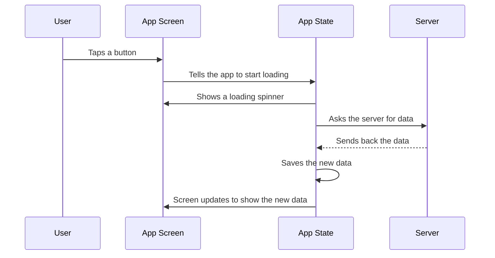

# Module 2.11 — Google ADK (Android Development Kit)

## What this shows
A diagram of what happens when someone taps a button in a mobile app to load data from a server.

## Diagram

## Steps explanation
1. User taps a button
2. The app shows a loading spinner right away
3. The app asks the server for data in the background, so the screen doesn't freeze
4. The server sends back the data
5. The app saves the new data
6. The screen updates automatically to show it

## Reference documentation
https://adk.dev/