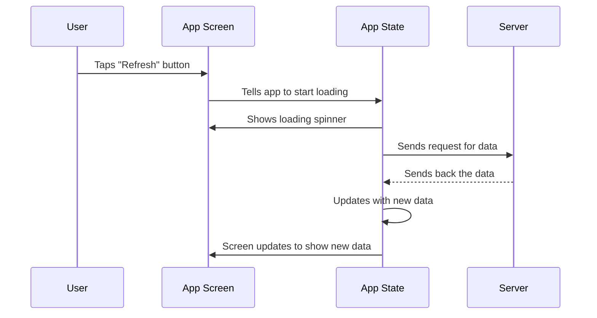

# Module 2.11 — Google ADK (Android Development Kit)

## What this shows
A simple diagram of what happens when a user taps a button in a mobile app to load data from a server.

## Diagram

## Steps explained simply
1. User taps a button
2. The app shows a loading spinner right away
3. The app asks the server for data in the background (so the screen doesn't freeze)
4. When the server replies, the app saves the new data
5. The screen updates automatically to show it

## Reference documentation
https://adk.dev/