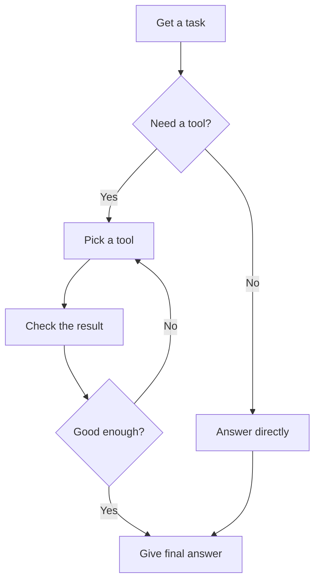

# Module 2.12 — Skills Agentic AI

## What this shows
A simple diagram of how an AI agent picks a tool, checks the result, and gives a final answer.

## Diagram

## Steps explained simply
1. Agent gets a task
2. Decides if it needs a tool (like web search) or can answer directly
3. Picks the right tool
4. Checks if the result is good
5. If not good, tries again
6. Gives the final answer

## Reference documentation
https://agentskills.io/home