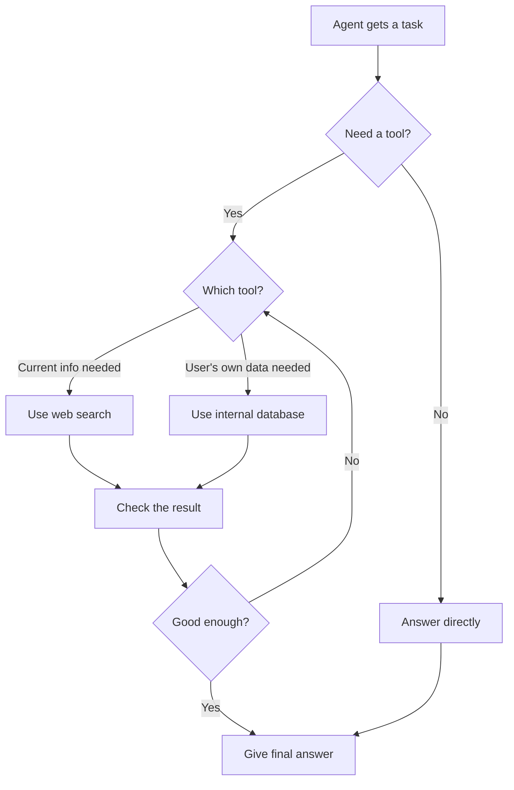

# Module 2.12 — Skills Agentic AI

## What this shows
A diagram of how an AI agent decides what to do with a task — like whether it needs a tool, which tool to use, and how it gives a final answer.

## Diagram

## Steps explained simply
1. The agent gets a task
2. It decides if it needs a tool or can answer right away
3. If it needs a tool, it picks the right one 
4. It checks if the result from the tool is actually useful
5. If not good enough, it tries a different tool or tries again
6. Once it has enough good info, it gives the final answer

## Reference documentation
https://agentskills.io/home