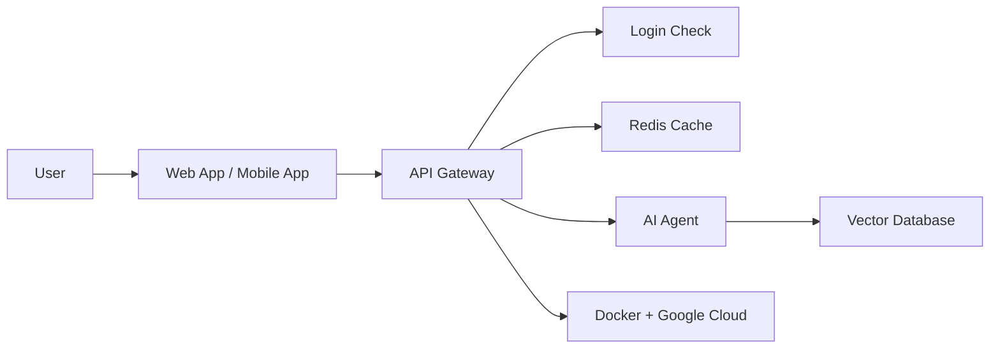

# Capstone — Intelligent Assistant System

## What this is
This brings together everything from all 12 modules into one big system: a smart assistant that a user can ask questions to.

## How it all connects



## What each part does

| Part | What it does | Which module |
|---|---|---|
| Web/Mobile App | Where the user types their question | Next.js, Google ADK |
| API Gateway | Receives the request, checks it's safe | Node.js, FastAPI |
| Login Check | Makes sure the user is really logged in | Firebase Auth |
| Redis Cache | Checks if we already have this answer saved | Redis |
| Vector Database | Looks up related info for the question | MongoDB, Pinecone |
| AI Agent | Decides how to answer, maybe using a tool | LangChain, Agentic AI |
| Docker + Cloud | Where all of this actually runs | Docker, GCP |

## How a question travels through the system
1. User asks a question on the app
2. The app sends it to the gateway
3. The gateway checks the user is logged in
4. It checks Redis first — if the answer is already saved, send it back right away
5. If not, the AI agent looks up helpful info from the database
6. The agent decides on the best answer
7. The answer is sent back to the user
8. Everything runs inside Docker, hosted on Google Cloud

## Folder structure
```
journeybuddy-curriculum/
├── 01-nextjs/
├── 02-nodejs/
├── 03-fastapi/
├── 04-firebase-auth/
├── 05-mongodb-vector/
├── 06-pinecone/
├── 07-redis/
├── 08-docker/
├── 09-gcp/
├── 10-langchain/
├── 11-google-adk/
├── 12-agentic-ai/
└── 13-capstone/
```